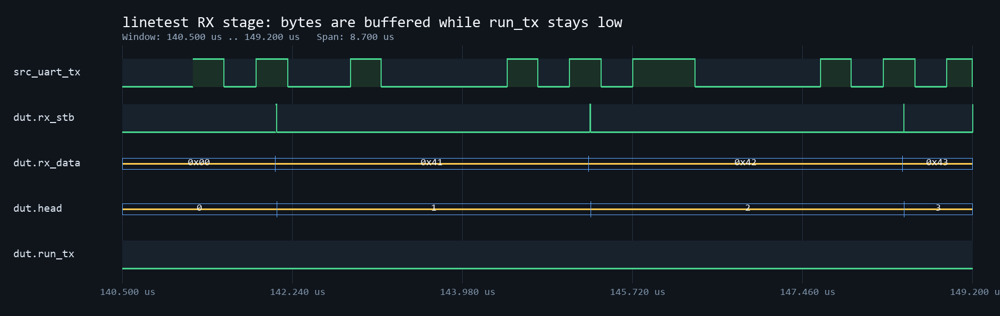
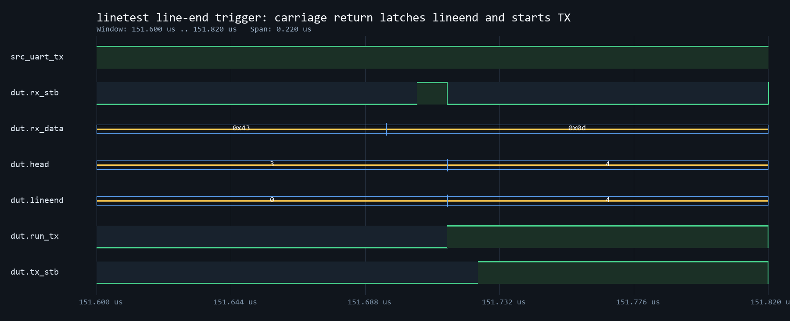
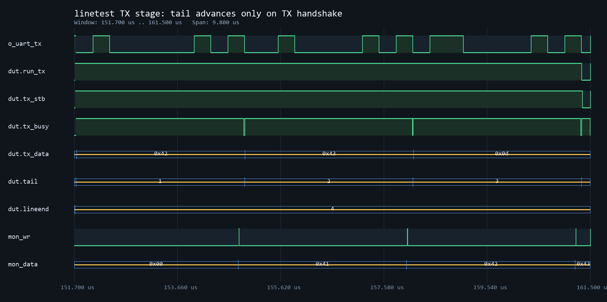

# linetest 学习记录

## 1. 功能理解

### 它是什么

`linetest` 是一个基于 UART 的“整行缓存回显”测试模块。

它和 `echotest` 的区别是：

```text
echotest  : 收到 1 个字节，立刻发回 1 个字节
linetest  : 先把一行数据缓存起来，再整行发回
```

也就是说，`linetest` 不是“立即回显”，而是“缓存后回显”。

### 为什么要学它

它同时把 3 个知识点串在一起：

1. UART RX 怎么把串口数据变成字节。
2. 环形缓存怎么用 `head/tail` 管理读写。
3. UART TX 怎么把缓存里的整行数据按顺序发出去。

### 怎么工作

```text
i_uart_rx
   |
   v
rxuart -> rx_stb/rx_data
   |
   v
buffer[head] 写入
   |
   v
lineend / run_tx 判断“这一行是否结束”
   |
   v
buffer[tail] 读出
   |
   v
txuart -> o_uart_tx
```

### 最小例子

如果输入一行：

```text
A B C \r
```

那么模块内部流程是：

1. `A`、`B`、`C`、`\r` 依次被 `rxuart` 收到。
2. 每次 `rx_stb=1` 时，把 `rx_data` 写到 `buffer[head]`。
3. 当收到 `\r` 时，`lineend <= head + 1`，同时 `run_tx <= 1`。
4. 发送器开始从 `buffer[tail]` 顺序取出整行数据并回发。

## 2. 核心状态机 / 逻辑分析

`linetest` 没有单独写成 `case` 状态机，但本质上可以拆成 3 段控制逻辑。

### 2.1 接收并写入缓存

- `rx_stb=1` 表示 UART 接收器刚刚拼出了一个完整字节。
- `buffer[head] <= rx_data` 始终在写当前地址。
- 只有满足下面条件时，`head` 才会真正前进：

```text
rx_stb && !rx_break && !rx_perr && !rx_ferr && (nxt_head != tail)
```

这表示：

1. 必须真的收到一个完整字节。
2. 这个字节不能是错误帧。
3. FIFO 不能写满覆盖未发送的数据。

### 2.2 行结束判定

`run_tx` 表示“允许进入整行发送阶段”。

触发条件有两个：

1. 收到换行 `0x0A` 或回车 `0x0D`。
2. 缓存字符数超过 80。

发送停止条件：

```text
tail == lineend
```

这说明当前这一行已经全部发完。

### 2.3 为什么 `lineend <= head + 1`

因为触发结束的那个字符本身也属于这一行。

如果当前结束字符写在 `buffer[head]`，那么这一行的发送边界应该落在“下一个位置之前”，也就是 `head+1`。

否则会少发最后一个字符。

### 2.4 为什么 `tail` 不能乱动

`tail` 只能在下面这个握手成立时前进：

```text
tx_stb && !tx_busy
```

原因是：

1. `tx_stb=1` 只是“我想发”。
2. `tx_busy=0` 才表示发送器当前真的能接收新字节。
3. 只有发送器真正收走这个字节后，`tail` 才能前进。

否则会出现跳读、丢字节、顺序错乱。

## 3. 关键知识点总结

### 3.1 这是“带 FIFO 思想”的行缓存

这里虽然没有单独实例化正式 FIFO 模块，但已经具备了 FIFO 的核心思想：

- `buffer` 存数据
- `head` 指向写位置
- `tail` 指向读位置

### 3.2 `nused = head - tail`

在环形缓存里，`head-tail` 可以表示当前已使用深度。

即使地址回绕，只要位宽固定，这个表达式依然成立。

### 3.3 接收路径和发送路径是独立的

这是 `linetest` 很重要的一点：

1. TX 正在发当前行，不代表 RX 会停止。
2. 新收到的字节仍然可以继续进入缓存。
3. `lineend` 的作用就是锁定“本轮发送边界”，避免 TX 追着变化中的 `head` 跑。

## 4. ModelSim 波形分析

### 4.1 这一步要看什么

这一步的核心目标不是“看串口线是不是在抖”，而是回答一句话：

```text
linetest 到底是不是先收满一行，再开始发送？
```

### 4.2 推荐观察信号

优先观察这 10 个信号：

1. `i_uart_rx`
2. `dut.rx_stb`
3. `dut.rx_data`
4. `dut.head`
5. `dut.tail`
6. `dut.lineend`
7. `dut.run_tx`
8. `dut.tx_stb`
9. `dut.tx_busy`
10. `o_uart_tx`

这里的 `dut` 指 testbench 里实例化的 `linetest`。

### 4.3 观察顺序

建议按下面顺序看波形。

#### 阶段 1：接收阶段

要确认：

1. `i_uart_rx` 上有完整 UART 帧。
2. 每当 `dut.rx_stb` 拉高一次，`dut.head` 就前进一次。
3. 在收到 `\r` 之前，`dut.run_tx` 应该保持为 `0`。

#### 阶段 2：触发行结束

要确认：

1. 收到 `\r` 的那个字节时，`dut.lineend` 被锁存。
2. 同时 `dut.run_tx` 拉高。
3. 这说明系统正式从“接收积累”切换到“发送整行”。

#### 阶段 3：发送阶段

要确认：

1. `dut.tx_stb` 会持续请求发送。
2. `dut.tail` 不是每拍都动，而是只在 `dut.tx_busy=0` 的握手拍前进。
3. 当 `dut.tail == dut.lineend` 时，`dut.run_tx` 变回 `0`。

### 4.4 波形里你应该写出的结论

做工程日志时，建议你把结论写成下面这种句式：

```text
在 t=xx us 附近，收到回车字符后，run_tx 由 0 变 1，
lineend 锁存为 head+1。随后 tx_stb 持续请求发送，
tail 仅在 !tx_busy 时前进，证明 linetest 采用“整行缓存后回显”的工作方式。
```

### 4.5 推荐截图命名

把截图放到 `waveform/`，命名建议如下：

1. `waveform/linetest_rx_stage.png`
2. `waveform/linetest_lineend_trigger.png`
3. `waveform/linetest_tx_stage.png`

### 4.6 GitHub 展示版波形图集

#### 图 1：回车到达前，系统只接收不发送

<p align="center">
  
</p>

> 观察点：`dut.rx_stb` 每确认一个字节，`dut.head` 就前进一步；在回车到达前，`dut.run_tx` 始终保持为 `0`。

#### 图 2：回车触发 `lineend` 锁存和 `run_tx` 拉高

<p align="center">
  
</p>

> 观察点：回车 `0x0d` 到达时，`dut.head` 从 `3` 变 `4`，`dut.lineend` 同步锁存为 `4`，`dut.run_tx` 由 `0` 变 `1`，随后 `dut.tx_stb` 开始请求发送。

#### 图 3：发送阶段只在握手点推进 `tail`

<p align="center">
  
</p>

> 观察点：`dut.tx_stb` 持续请求发送，但 `dut.tail` 只会在 `!dut.tx_busy` 的握手时刻推进，严格按 `A/B/C/\r` 顺序吐出整行数据。

### 4.7 本次实际截图对应的关键时间点

1. `linetest_rx_stage.png`
   覆盖 `140.500 us ~ 149.200 us`，能看到 `A`、`B`、`C` 进入缓存前两拍的接收过程。
2. `151.715 us`
   `dut.rx_stb` 对回车 `0x0d` 拉高，`dut.head` 由 `3` 变 `4`，`dut.lineend` 同时锁存为 `4`，`dut.run_tx` 由 `0` 变 `1`。
3. `151.725 us`
   `dut.tx_stb` 开始请求发送，说明系统已经从“接收积累”切换到“发送整行”。
4. `151.735 us / 154.935 us / 158.135 us / 161.335 us`
   `dut.tail` 分别推进到 `1/2/3/4`，对应 `A/B/C/\r` 被发送器依次收走。
5. `linetest_tx_stage.png`
   覆盖 `151.700 us ~ 161.500 us`，重点证明 `tail` 只在 `!tx_busy` 的握手点前进，而不是每拍自增。

## 5. Debug / 遇到的问题

### 问题 1

为什么分析 `linetest` 时，不建议只盯着 `i_uart_rx`？

原因：

`i_uart_rx` 只是串口原始电平，信息粒度是“位级别”。  
而 `linetest` 的核心行为是“字节级缓存”和“整行级发送”，所以必须重点看 `rx_stb`、`head`、`tail`、`run_tx`。

### 问题 2

为什么 `tail` 不能在 `run_tx=1` 时每拍都加 1？

原因：

因为发送器可能还在忙。  
如果没等 `!tx_busy` 就前进，后面的字节就会被跳过，形成数据丢失。

## 6. 解决方案和验证结果

### 解决方案

1. 通过 testbench 发送 `A B C \r` 到 `linetest`。
2. 在波形中同时观察接收、缓存边界、发送握手。
3. 用 `host_rx` 监视回显结果，确认回发顺序正确。

### 实际验证结果

1. 本地仿真日志已经确认 `DUT RX` 依次收到 `0x41`、`0x42`、`0x43`、`0x0d`，对应 `A/B/C/\r`。
2. 随后 `DUT TX` 依次打印 `0x41`、`0x42`、`0x43`、`0x0d`，说明发送边界在收到回车后被锁定。
3. 监视器 `monitor_rx` 同步收到 `Echo byte = 0x41/0x42/0x43/0x0d`，说明回显链路完整闭环。
4. `waveform/linetest_rx_stage.png` 已证明：在回车到达前，`dut.head` 递增而 `dut.run_tx=0`，系统仍处于纯接收积累阶段。
5. `waveform/linetest_lineend_trigger.png` 已证明：回车到达的同一拍附近，`dut.lineend` 被锁存为 `4`，`dut.run_tx` 拉高，`dut.tx_stb` 紧接着发起发送请求。
6. `waveform/linetest_tx_stage.png` 已证明：`dut.tail` 只会在 `!dut.tx_busy` 的发送握手点前进，整行数据按顺序被取出。
7. 这证明 `linetest` 的行为是“先缓存一行，再按顺序发送”，而不是收到单字节立即回显。

## 7. 今日反思

### 我已经掌握了什么

1. `linetest` 不是立即回显，而是行缓存回显。
2. `head` 管写入，`tail` 管读出，`lineend` 管本轮发送边界。
3. `run_tx` 只是发送阶段使能，不代表接收器停止工作。

### 我还需要补什么

1. 可以补一条“如果 `tail` 提前移动会造成什么错误”的反例日志。
2. 可以把当前 VCD 渲染脚本复用到 FIFO 或更上层 UART 系统接口模块。
3. 下一步更适合进入 FIFO、Wishbone 或 Modbus 之一，而不是继续停留在 `linetest` 基础行为上。

### 检查题

为什么 `lineend` 必须单独锁存，而不能直接用不断变化的 `head` 当发送终点？

### 最小练习

本次仿真后的一句话总结：

```text
linetest 的“缓存一整行再发送”最直接的证据，是回车到达前只看到 RX 累积而没有 TX 输出，回车到达后才开始按 `A/B/C/\r` 顺序连续回发。
```
